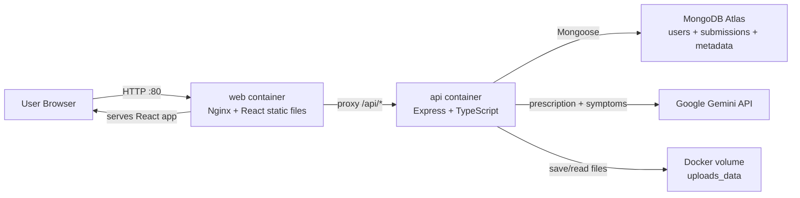

# AI Health Companion

AI Health Companion is a full-stack prescription summarization app. A user can create an account, upload a prescription with symptom notes, and later view the saved Gemini-generated structured summary from their private history.

This repository contains:

- React client
- Express API
- MongoDB Atlas persistence
- Gemini integration
- Dockerfiles
- Docker Compose setup for local Docker testing
- Docker image based EC2 deployment runbook

## Architecture



### Request Flow

1. Browser opens `http://localhost` locally or `http://EC2_PUBLIC_IP` on EC2.
2. Nginx serves the built React app from the `web` container.
3. React calls `/api/...`.
4. Nginx proxies `/api/...` to the `api` container on port `4000`.
5. Express handles auth, upload validation, PDF text extraction, Gemini analysis, and MongoDB persistence.
6. MongoDB Atlas stores users, submissions, saved Gemini output, and metadata.
7. Uploaded prescription files are stored in the Docker volume `uploads_data`.

## Tech Stack

- Frontend: Vite, React, TypeScript, React Router, Tailwind CSS, lucide-react
- Backend: Node.js, Express, TypeScript, Mongoose, Zod, Multer, JWT, bcrypt
- AI: Google Gemini API via `@google/genai`
- Database: MongoDB Atlas
- Containerization: Docker, Docker Compose
- Web server/proxy: Nginx inside the `web` container
- Tests: Vitest and Supertest

## Features Completed

- Email/password signup and login
- Password hashing with bcrypt
- JWT session stored in an HttpOnly cookie
- Protected dashboard and submission APIs
- JPG, PNG, and PDF prescription upload
- One PDF or up to five image pages per submission
- 5 MB per-file upload limit
- Symptom notes capture with validation
- PDF embedded-text extraction before falling back to Gemini file input
- Gemini structured JSON response
- Saved submission history per user
- Submission detail page with original prescription file access
- User-visible medical disclaimer
- Mock AI mode for local testing
- MongoDB persistence for users, submissions, AI analysis, and metadata
- Dockerized frontend and backend
- Nginx routing for React and `/api`
- EC2 deployment through Docker images

## AI Analysis Flow

1. User uploads a prescription and symptom notes.
2. Server validates auth, file type, file count, file size, and notes.
3. For PDFs, server tries embedded text extraction first.
4. If text is useful, Gemini receives extracted text.
5. If text is weak or upload is an image, Gemini receives file bytes.
6. Gemini returns structured JSON.
7. Server validates the JSON with Zod.
8. Server saves the analysis in MongoDB.
9. Future page loads read saved MongoDB data and do not re-call Gemini.

## Future Scope

- Medicine reminders and notifications
- Email verification and password reset
- Refresh-token rotation and account lockout
- Rate limiting
- Background job queue for long Gemini requests
- Bounded retry/fallback handling for transient Gemini API failures, for example retrying a failed request a few times with exponential backoff before returning a clear error to the user
- S3/object storage for uploaded files
- Local OCR engine such as Tesseract
- HTTPS termination in this repository
- Production medical compliance workflows

## Environment Variables

Never commit real env files or secrets.

### Server Env: `server/.env` for local source/Docker builds

Used by the Express API.

```env
PORT=4000
CLIENT_ORIGIN=http://localhost:5173
MONGODB_URI=mongodb+srv://<username>:<password>@<cluster-host>/health-companion?retryWrites=true&w=majority
JWT_SECRET=replace_with_a_long_random_secret
JWT_EXPIRES_IN=7d
COOKIE_NAME=hms_token
COOKIE_SECURE=false
UPLOAD_DIR=uploads
AI_MOCK_MODE=true
GEMINI_API_KEY=
GEMINI_MODEL=gemini-2.5-flash
```

For real Gemini:

```env
AI_MOCK_MODE=false
GEMINI_API_KEY=<your_google_ai_studio_key>
```

### Client Env: `client/.env` for local Vite dev

```env
VITE_API_BASE_URL=http://localhost:4000/api
```

### Root Env: `.env` for Docker Compose

Used by Compose for values outside the API container.

```env
PUBLIC_ORIGIN=http://localhost
COOKIE_SECURE=false
```

For EC2 over HTTP:

```env
PUBLIC_ORIGIN=http://<EC2_PUBLIC_IP>
COOKIE_SECURE=false
```

### Image Deployment Env: `server.env` on EC2

Used by `docker-compose.prod.yml`.

```env
MONGODB_URI=mongodb+srv://<username>:<password>@<cluster-host>/health-companion?retryWrites=true&w=majority
JWT_SECRET=replace_with_a_long_random_secret
JWT_EXPIRES_IN=7d
COOKIE_NAME=hms_token
COOKIE_SECURE=false
UPLOAD_DIR=/app/uploads
AI_MOCK_MODE=false
GEMINI_API_KEY=<your_google_ai_studio_key>
GEMINI_MODEL=gemini-2.5-flash
PORT=4000
```

### How To Get Values

- `MONGODB_URI`: MongoDB Atlas -> Cluster -> Connect -> Drivers -> Node.js connection string. Add `/health-companion` before the query string.
- `JWT_SECRET`: generate a long random string, for example `openssl rand -hex 32`.
- `GEMINI_API_KEY`: create an API key in Google AI Studio.
- `PUBLIC_ORIGIN`: browser-facing URL, such as `http://localhost` or `http://<EC2_PUBLIC_IP>`.
- `COOKIE_SECURE`: `false` for HTTP, `true` only when HTTPS is configured.

## Local Setup Without Docker

Prerequisites:

- Node.js 22 or another modern Node.js version
- npm
- MongoDB Atlas connection string
- Gemini key if not using mock mode

Install dependencies:

```bash
npm run install:all
```

Create local env files:

```bash
cp server/.env.example server/.env
cp client/.env.example client/.env
```

On Windows PowerShell:

```powershell
Copy-Item server\.env.example server\.env
Copy-Item client\.env.example client\.env
```

For first local test, keep:

```env
AI_MOCK_MODE=true
```

Start backend:

```bash
npm run dev:server
```

Start frontend in another terminal:

```bash
npm run dev:client
```

Open:

```text
http://localhost:5173
```

## Local Docker Build And Run

This uses the root `docker-compose.yml` and builds images from local source code.

Create:

- `server/.env`
- root `.env`

Build and run:

```bash
docker compose up -d --build
```

Open:

```text
http://localhost
```

Useful commands:

```bash
docker compose ps
docker compose logs -f
docker compose logs -f api
docker compose logs -f web
docker compose down
```

Delete containers and uploaded-file volume:

```bash
docker compose down -v
```

Use `-v` carefully because it deletes uploaded prescriptions stored in `uploads_data`.

## Build And Push Docker Images

Use this flow when deploying images directly on EC2.

Create two Docker Hub repositories:

```text
health-companion-api
health-companion-web
```

Login:

```bash
docker login
```

Build images from project root:

```bash
docker build -t <DOCKERHUB_USERNAME>/health-companion-api:latest ./server
docker build -t <DOCKERHUB_USERNAME>/health-companion-web:latest ./client
```

Push:

```bash
docker push <DOCKERHUB_USERNAME>/health-companion-api:latest
docker push <DOCKERHUB_USERNAME>/health-companion-web:latest
```

If the repositories are private, EC2 must also run `docker login` before pulling.

## EC2 Deployment Runbook: Pull Images Directly

This is the preferred deployment mode for this project: EC2 pulls already-built Docker Hub images and runs containers. The application does not run natively on the host.

### 1. Launch EC2

Use:

- Ubuntu AMI
- `t2.micro` or `t3.micro`
- 8-20 GB EBS volume
- Security group:
  - SSH `22` from your IP only
  - HTTP `80` from `0.0.0.0/0`
  - Do not expose backend port `4000`
  - Do not expose MongoDB ports

HTTPS will not work unless you separately configure TLS and port `443`.

### 2. Install Docker On EC2

SSH:

```bash
ssh -i <key.pem> ubuntu@<EC2_PUBLIC_IP>
```

Install Docker Engine and Compose plugin:

```bash
sudo apt update
sudo apt install -y ca-certificates curl
sudo install -m 0755 -d /etc/apt/keyrings
sudo curl -fsSL https://download.docker.com/linux/ubuntu/gpg -o /etc/apt/keyrings/docker.asc
sudo chmod a+r /etc/apt/keyrings/docker.asc
sudo tee /etc/apt/sources.list.d/docker.sources <<EOF
Types: deb
URIs: https://download.docker.com/linux/ubuntu
Suites: $(. /etc/os-release && echo "${UBUNTU_CODENAME:-$VERSION_CODENAME}")
Components: stable
Architectures: $(dpkg --print-architecture)
Signed-By: /etc/apt/keyrings/docker.asc
EOF
sudo apt update
sudo apt install -y docker-ce docker-ce-cli containerd.io docker-buildx-plugin docker-compose-plugin
```

Allow the `ubuntu` user to run Docker:

```bash
sudo usermod -aG docker ubuntu
```

Log out and SSH back in.

Verify:

```bash
docker ps
docker compose version
```

### 3. Allow EC2 In MongoDB Atlas

MongoDB Atlas -> Network Access -> Add IP Address:

```text
<EC2_PUBLIC_IP>/32
```

If the EC2 public IP changes, update Atlas again. Use an Elastic IP if you want it stable.

### 4. Create Deployment Folder On EC2

```bash
mkdir health-companion
cd health-companion
```

Create `docker-compose.yml`:

```bash
nano docker-compose.yml
```

Use the contents of `docker-compose.prod.yml` from this repository, or paste:

```yaml
services:
  api:
    image: ${API_IMAGE}
    env_file:
      - ./server.env
    environment:
      NODE_ENV: production
      PORT: 4000
      UPLOAD_DIR: /app/uploads
      CLIENT_ORIGIN: ${PUBLIC_ORIGIN}
      COOKIE_SECURE: ${COOKIE_SECURE:-false}
    volumes:
      - uploads_data:/app/uploads
    expose:
      - "4000"
    restart: unless-stopped
    healthcheck:
      test:
        [
          "CMD",
          "node",
          "-e",
          "fetch('http://localhost:4000/api/health').then((r)=>process.exit(r.ok?0:1)).catch(()=>process.exit(1))"
        ]
      interval: 30s
      timeout: 5s
      retries: 3
      start_period: 20s

  web:
    image: ${WEB_IMAGE}
    ports:
      - "80:80"
    depends_on:
      api:
        condition: service_healthy
    restart: unless-stopped

volumes:
  uploads_data:
```

Create root `.env`:

```bash
nano .env
```

Example:

```env
API_IMAGE=<DOCKERHUB_USERNAME>/health-companion-api:latest
WEB_IMAGE=<DOCKERHUB_USERNAME>/health-companion-web:latest
PUBLIC_ORIGIN=http://<EC2_PUBLIC_IP>
COOKIE_SECURE=false
```

Create `server.env`:

```bash
nano server.env
```

Example:

```env
MONGODB_URI=mongodb+srv://<username>:<password>@<cluster-host>/health-companion?retryWrites=true&w=majority
JWT_SECRET=replace_with_a_long_random_secret
JWT_EXPIRES_IN=7d
COOKIE_NAME=hms_token
COOKIE_SECURE=false
UPLOAD_DIR=/app/uploads
AI_MOCK_MODE=false
GEMINI_API_KEY=<your_google_ai_studio_key>
GEMINI_MODEL=gemini-2.5-flash
PORT=4000
```

### 5. Pull And Run

```bash
docker compose pull
docker compose up -d
```

Check:

```bash
docker compose ps
docker compose logs -f api
docker compose logs -f web
curl http://localhost/api/health
```

Open:

```text
http://<EC2_PUBLIC_IP>
```

### 6. Update Deployment After Code Changes

On your laptop:

```bash
docker build -t <DOCKERHUB_USERNAME>/health-companion-api:latest ./server
docker build -t <DOCKERHUB_USERNAME>/health-companion-web:latest ./client
docker push <DOCKERHUB_USERNAME>/health-companion-api:latest
docker push <DOCKERHUB_USERNAME>/health-companion-web:latest
```

On EC2:

```bash
cd health-companion
docker compose pull
docker compose up -d
```

### 7. Uploaded File Storage On EC2

Inside the API container:

```text
/app/uploads
```

Docker volume:

```text
uploads_data
```

Inspect:

```bash
docker volume ls
docker compose exec api ls -lah /app/uploads
```

Do not run this in production unless you intentionally want to delete uploaded files:

```bash
docker compose down -v
```

## API Summary

Auth:

- `POST /api/auth/signup`
- `POST /api/auth/login`
- `POST /api/auth/logout`
- `GET /api/auth/me`

Submissions:

- `POST /api/submissions`
- `GET /api/submissions`
- `GET /api/submissions/:id`
- `GET /api/submissions/:id/file`
- `GET /api/submissions/:id/files/:fileIndex`

Health:

- `GET /api/health`

## Data Model Summary

- `users`: email, password hash, timestamps
- `submissions`: user ID, symptoms, file metadata, extraction mode, extracted text, status, AI analysis, error message, timestamps
- `metadata`: Gemini operation, model, response time, token usage, raw usage metadata, linked user/submission

## Known Issues And Tradeoffs

- This is a demo app, not production healthcare software.
- Gemini can misread prescriptions or produce incomplete output.
- Users must verify all medicine and dosage information with a licensed clinician.
- HTTP deployment is supported; HTTPS requires extra TLS/domain setup.
- `COOKIE_SECURE=false` is acceptable only for local/HTTP demo deployments.
- Uploaded files are stored in a Docker volume, not S3.
- Docker volume data is tied to the host and must be backed up separately.
- MongoDB Atlas is external, so deployment requires Atlas credentials and IP allowlisting.
- The AI request runs synchronously during upload, so users wait for Gemini.
- Gemini can occasionally fail because of transient network, quota, or provider-side issues; the current version surfaces a clear error, while a future version should use bounded retries instead of an infinite loop.
- No reminders, email notifications, rate limiting, password reset, or email verification in this version.


<!-- ## Tests And Build

Backend tests:

```bash
npm --prefix server run test
```

Backend build:

```bash
npm --prefix server run build
```

Frontend build:

```bash
npm --prefix client run build
```

Docker local build:

```bash
docker compose up -d --build -->
```